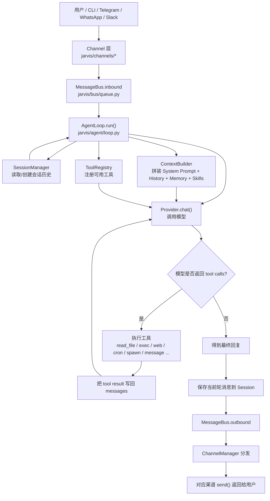
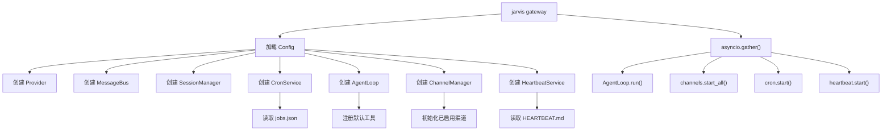
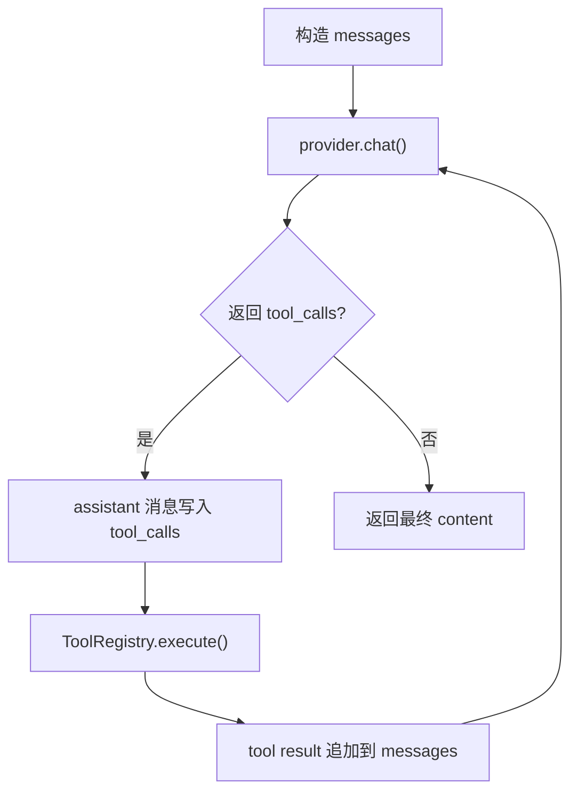

# Jarvis 项目代码库说明与二次开发指南

本文整理了对 `jarvis` 整个代码库的阅读结果，重点覆盖：

- 项目整体定位
- 核心模块职责
- 用户消息在系统中的完整流转
- 本地与多渠道启动方式
- Prompt / 工具 / 记忆 / 定时任务机制
- Prompt cache 的自动开启逻辑
- 二次开发的切入点

适合第一次接手这个项目、准备做二次开发时快速建立全局认知。

---

## 1. 项目是什么

`jarvis` 是一个轻量级个人 AI 助手框架，核心实现是 Python，额外带了一个用于 WhatsApp 的 Node.js bridge。

它不是传统意义上的 Web 应用，没有前后端分离页面。它的本质是一个：

- 多渠道消息接入层
- 统一 Agent 运行时
- 可插拔工具系统
- 会话与长期记忆系统
- 定时任务与心跳任务系统

整体目标是让一个 LLM agent 能够：

- 通过 CLI 或聊天平台与用户对话
- 使用工具读写文件、执行命令、搜索网页
- 维护会话历史与长期记忆
- 处理定时任务和周期性任务
- 支持多模型 provider 和多聊天渠道

---

## 2. 技术栈与仓库结构

### 2.1 技术栈

- 主体语言：Python 3.11+
- CLI：Typer
- LLM 路由：LiteLLM
- 数据模型：Pydantic / pydantic-settings
- 异步通信：asyncio
- WhatsApp bridge：TypeScript + Node.js + Baileys

### 2.2 关键目录

```text
jarvis/
  agent/         Agent 主循环、上下文、记忆、技能、subagent
  agent/tools/   工具系统
  bus/           消息总线
  channels/      各聊天渠道接入
  cli/           命令行入口
  config/        配置模型与加载逻辑
  cron/          定时任务
  heartbeat/     周期心跳任务
  providers/     LLM provider 抽象与实现
  session/       会话持久化
  templates/     workspace 初始化模板
  skills/        内置技能

bridge/
  src/           WhatsApp Node bridge

tests/
  各模块测试
```

---

## 3. 启动入口

### 3.1 Python 入口

- 模块入口：`jarvis/__main__.py`
- CLI 主入口：`jarvis/cli/commands.py`

从代码上看，所有常用命令都挂在 `Typer` 应用里，最重要的是：

- `jarvis onboard`
- `jarvis agent`
- `jarvis gateway`
- `jarvis channels login`

### 3.2 常用启动模式

#### 模式 A：本地 CLI 交互

适合调试 Agent 主流程。

```bash
pip install -e .
jarvis onboard
jarvis agent
```

也可以单次发消息：

```bash
jarvis agent -m "Hello"
```

#### 模式 B：多渠道网关模式

适合接 Telegram / Slack / WhatsApp / Discord 等聊天平台。

```bash
jarvis gateway
```

`gateway` 会常驻运行，并启动：

- `MessageBus`
- `AgentLoop`
- `ChannelManager`
- `CronService`
- `HeartbeatService`

#### 模式 C：WhatsApp bridge 登录

WhatsApp 依赖 Node bridge，需要先登录：

```bash
jarvis channels login
```

这个命令会：

1. 复制 `bridge/` 到 `~/.jarvis/bridge`
2. 自动执行 `npm install`
3. 自动执行 `npm run build`
4. 启动 bridge
5. 在终端展示二维码供 WhatsApp 扫码绑定

扫码完成后，再执行：

```bash
jarvis gateway
```

---

## 4. 最小可用启动配置

初始化后会生成：

- `~/.jarvis/config.json`
- `~/.jarvis/workspace`

最小配置通常只需要 provider + model：

```json
{
  "providers": {
    "openrouter": {
      "apiKey": "sk-or-v1-xxx"
    }
  },
  "agents": {
    "defaults": {
      "model": "anthropic/claude-opus-4-5",
      "provider": "openrouter"
    }
  }
}
```

如果要启用 Telegram，例如：

```json
{
  "channels": {
    "telegram": {
      "enabled": true,
      "token": "YOUR_BOT_TOKEN",
      "allowFrom": ["YOUR_USER_ID"]
    }
  }
}
```

注意：

- `allowFrom` 为空时，代码会认为“拒绝所有”
- 设为 `["*"]` 才是允许所有人

---

## 5. 系统主流程

这个项目最核心的逻辑是：渠道只负责收发消息，真正的智能处理统一由 `AgentLoop` 执行。

### 5.1 全局消息流



### 5.2 Gateway 装配流程



### 5.3 工具调用循环



---

## 6. 核心模块说明

### 6.1 CLI 与运行时装配

文件：

- `jarvis/cli/commands.py`

职责：

- 提供命令行入口
- 加载配置
- 创建 provider
- 创建 `AgentLoop`
- 创建 `ChannelManager`
- 创建 `CronService` / `HeartbeatService`
- 处理 CLI 交互模式和 gateway 模式

这是整个项目的“装配中心”。

### 6.2 Config 配置系统

文件：

- `jarvis/config/schema.py`
- `jarvis/config/loader.py`
- `jarvis/config/paths.py`

职责：

- 定义所有配置结构
- 从 `~/.jarvis/config.json` 加载配置
- 解析 workspace、cron、logs、media 等运行路径

这里控制：

- 默认模型
- provider API key
- 各渠道启停
- web / exec / MCP 等工具配置
- 是否限制工具只能访问 workspace

### 6.3 MessageBus 消息总线

文件：

- `jarvis/bus/queue.py`
- `jarvis/bus/events.py`

职责：

- 解耦渠道层和 Agent 核心
- inbound queue：渠道发来的消息
- outbound queue：Agent 生成的回复

这是一个很简单但很关键的异步边界。

### 6.4 Channel 渠道层

文件：

- `jarvis/channels/base.py`
- `jarvis/channels/manager.py`
- `jarvis/channels/*.py`

职责：

- 接入不同聊天平台 SDK
- 做权限校验
- 解析用户消息和媒体
- 转成统一的 `InboundMessage`
- 把 `OutboundMessage` 再发送回渠道

关键点：

- 所有渠道都继承 `BaseChannel`
- `ChannelManager` 按 config 初始化已启用渠道
- 发送阶段统一从 outbound queue 消费

### 6.5 AgentLoop 主循环

文件：

- `jarvis/agent/loop.py`

职责：

- 从 inbound queue 取消息
- 根据 session 组装上下文
- 调用 LLM
- 执行工具
- 保存消息
- 输出最终回复

这是整个项目最核心的业务主循环。

### 6.6 ContextBuilder 提示词构造

文件：

- `jarvis/agent/context.py`

职责：

- 生成 system prompt
- 注入 workspace 中的模板文件
- 注入长期记忆
- 注入技能摘要
- 合并运行时元数据
- 组装当前用户输入与多模态内容

system prompt 的内容来源主要包括：

- identity
- `AGENTS.md`
- `SOUL.md`
- `USER.md`
- `TOOLS.md`
- `memory/MEMORY.md`
- skills summary

### 6.7 Session 会话系统

文件：

- `jarvis/session/manager.py`

职责：

- 按 `channel:chat_id` 持久化会话
- 使用 JSONL 存储消息历史
- 维护 `last_consolidated`
- 提供可送入 LLM 的历史窗口

存储位置：

- `workspace/sessions/*.jsonl`

### 6.8 Memory 长期记忆系统

文件：

- `jarvis/agent/memory.py`

职责：

- 把旧会话压缩成长期记忆
- 维护：
  - `workspace/memory/MEMORY.md`
  - `workspace/memory/HISTORY.md`

它不是简单把所有历史全塞给模型，而是按窗口归档，降低上下文膨胀。

### 6.9 Tool 工具系统

文件：

- `jarvis/agent/tools/base.py`
- `jarvis/agent/tools/registry.py`
- `jarvis/agent/tools/*.py`

默认工具包括：

- `read_file`
- `write_file`
- `edit_file`
- `list_dir`
- `exec`
- `web_search`
- `web_fetch`
- `message`
- `spawn`
- `cron`

工具注册发生在 `AgentLoop._register_default_tools()`。

### 6.10 Provider 模型调用层

文件：

- `jarvis/providers/base.py`
- `jarvis/providers/litellm_provider.py`
- `jarvis/providers/registry.py`

职责：

- 屏蔽不同模型厂商差异
- 统一 tool call 结果格式
- 处理 provider 选择、model prefix、参数兼容
- 支持 prompt caching 标记注入

### 6.11 Cron 定时任务

文件：

- `jarvis/cron/service.py`
- `jarvis/agent/tools/cron.py`

职责：

- 保存和调度定时任务
- 支持一次性任务、间隔任务、cron 表达式任务
- 到时间后通过 agent 执行任务

### 6.12 Heartbeat 心跳任务

文件：

- `jarvis/heartbeat/service.py`

职责：

- 周期性读取 `workspace/HEARTBEAT.md`
- 让模型先判断是否有活跃任务
- 若有，再走完整 agent 流程执行

它和 cron 的区别是：

- `cron` 更像显式调度器
- `heartbeat` 更像“定时唤醒 agent 看有没有事情做”

### 6.13 Subagent 后台任务

文件：

- `jarvis/agent/subagent.py`
- `jarvis/agent/tools/spawn.py`

职责：

- 后台起一个简化版 agent 处理长任务
- 完成后再通过 system message 通知主 agent 汇总输出

---

## 7. 用户消息的详细执行过程

以 Telegram 用户发一条消息为例：

1. `TelegramChannel` 收到平台消息
2. 渠道层做 `allowFrom` 权限校验
3. 把消息转成 `InboundMessage`
4. 消息进入 `MessageBus.inbound`
5. `AgentLoop.run()` 消费这条消息
6. 根据 `channel:chat_id` 获取对应 `Session`
7. 从 Session 取最近历史
8. `ContextBuilder.build_messages()` 组装完整 prompt
9. `provider.chat()` 调用模型
10. 若模型返回 tool calls，则执行工具并追加 tool result
11. 重复调用模型直到得到最终文本回复
12. 把本轮消息保存回 Session
13. 回复进入 `MessageBus.outbound`
14. `ChannelManager` 把回复交给 Telegram 渠道发送

这个设计的好处是：

- 渠道逻辑和 Agent 逻辑解耦
- 新增渠道成本较低
- 工具系统可插拔
- 会话、记忆、定时任务都可独立演进

---

## 8. Prompt 与模板系统

workspace 初始化时会自动同步模板文件：

- `AGENTS.md`
- `SOUL.md`
- `USER.md`
- `TOOLS.md`
- `HEARTBEAT.md`
- `memory/MEMORY.md`
- `memory/HISTORY.md`

这些模板来自：

- `jarvis/templates/`

其中：

- `AGENTS.md` 更偏行为规范
- `SOUL.md` 更偏人格设定
- `TOOLS.md` 更偏工具使用约束
- `HEARTBEAT.md` 是周期任务的任务列表

这套设计意味着：很多“二开行为调整”不一定非得改 Python 代码，也可以先改 workspace 模板和 skills。

---

## 9. Skills 技能系统

文件：

- `jarvis/agent/skills.py`
- `jarvis/skills/*`

设计特点：

- 内置技能和 workspace 自定义技能共存
- 系统 prompt 只放技能摘要，不把技能全文一次性塞进去
- 模型需要时再通过 `read_file` 读取 `SKILL.md`

这是一种 progressive loading 设计，优点是：

- 降低上下文长度
- 保持系统 prompt 简洁
- 技能可以独立扩展，不必改主代码

---

## 10. Provider 与 Prompt Cache 行为

### 10.1 是否会自动开启 Anthropic 或 Gemini 的 cache

结论：

- `Anthropic`：会自动开启 prompt cache 相关标记
- `OpenRouter`：会自动开启
- `Gemini`：当前不会自动开启

### 10.2 原因

在 `jarvis/providers/registry.py` 中，`ProviderSpec` 有一个字段：

- `supports_prompt_caching`

当前代码中，只有以下 provider 被标记为 `True`：

- `openrouter`
- `anthropic`

而 `gemini` 没有被标记为 `True`。

### 10.3 实际注入逻辑

在 `jarvis/providers/litellm_provider.py` 中：

1. `chat()` 会先调用 `_supports_cache_control(original_model)`
2. 如果返回 `True`，才会执行 `_apply_cache_control()`
3. `_apply_cache_control()` 会给：
   - system prompt
   - 最后一个 tool definition
   
注入：

```json
{
  "cache_control": {
    "type": "ephemeral"
  }
}
```

所以这是“代码显式允许才自动开启”，不是“只要模型支持就自动开”。

---

## 11. WhatsApp bridge 特殊说明

WhatsApp 不是纯 Python 实现，而是双层结构：

### Python 侧

- `jarvis/channels/whatsapp.py`

职责：

- 通过 WebSocket 连接本地 Node bridge
- 把 bridge 发来的消息转为 `InboundMessage`
- 把 outbound message 转成发送命令给 bridge

### Node 侧

- `bridge/src/server.ts`
- `bridge/src/whatsapp.ts`

职责：

- 使用 Baileys 接入 WhatsApp Web
- 处理二维码登录
- 下载媒体文件
- 把事件广播给 Python

如果你未来要改 WhatsApp 媒体支持、登录逻辑、去重策略，通常要同时看 Python 和 TypeScript 两层。

---

## 12. 二次开发怎么切入

### 12.1 想新增一个工具

看这里：

- `jarvis/agent/tools/base.py`
- `jarvis/agent/tools/registry.py`
- `jarvis/agent/loop.py`

做法：

1. 新建一个 `Tool` 子类
2. 定义 `name / description / parameters / execute`
3. 在 `AgentLoop._register_default_tools()` 注册

适合扩展：

- 数据库访问
- 企业内部 API
- 向量检索
- Git 操作
- 业务系统操作

### 12.2 想新增一个聊天渠道

看这里：

- `jarvis/channels/base.py`
- `jarvis/channels/manager.py`
- 参考现有 `telegram.py` / `slack.py` / `qq.py`

做法：

1. 继承 `BaseChannel`
2. 实现 `start()` / `stop()` / `send()`
3. 收到平台消息后调用 `_handle_message()`
4. 在 `ChannelManager` 中注册初始化逻辑

### 12.3 想调整 Agent 行为

优先看：

- `jarvis/agent/context.py`
- `jarvis/templates/*.md`
- `jarvis/agent/loop.py`

你可以改：

- system prompt 结构
- runtime metadata 注入方式
- 是否展示 progress / tool hints
- 最大工具迭代次数
- history window

### 12.4 想改长期记忆系统

看这里：

- `jarvis/agent/memory.py`
- `jarvis/session/manager.py`

可以改的方向：

- 归档触发阈值
- 归档 prompt
- MEMORY / HISTORY 的格式
- 是否引入结构化 memory store

### 12.5 想改定时任务或自动执行逻辑

看这里：

- `jarvis/cron/service.py`
- `jarvis/heartbeat/service.py`
- `jarvis/agent/tools/cron.py`

这部分很适合做：

- 更复杂的计划任务
- 定时巡检
- 自动报告
- 周期唤醒与任务编排

### 12.6 想改模型接入或缓存行为

看这里：

- `jarvis/providers/registry.py`
- `jarvis/providers/litellm_provider.py`

适合改：

- provider 自动匹配策略
- model prefix 规则
- cache_control 逻辑
- 特定模型参数覆盖

---

## 13. 建议的阅读顺序

如果你准备正式二开，我建议按下面顺序读代码：

1. `jarvis/cli/commands.py`
2. `jarvis/agent/loop.py`
3. `jarvis/agent/context.py`
4. `jarvis/agent/tools/*`
5. `jarvis/session/manager.py`
6. `jarvis/agent/memory.py`
7. `jarvis/channels/*`
8. `jarvis/providers/*`
9. `jarvis/cron/service.py`
10. `jarvis/heartbeat/service.py`

这条路径能先建立系统主干，再看各能力模块。

---

## 14. 一句话总结

`jarvis` 的架构核心是：

“渠道负责收发消息，AgentLoop 负责统一调度，Provider 负责调用模型，Tools 负责行动，Session/Memory 负责持久化，Cron/Heartbeat 负责时间驱动任务。”

如果你要做二次开发，最省力的切入点通常不是直接改大量核心逻辑，而是先判断你的需求属于哪一类：

- 新能力：加 Tool
- 新接入：加 Channel
- 新行为：改 Context / 模板 / Skills
- 新自动化：改 Cron / Heartbeat
- 新模型策略：改 Provider / Registry

---

## 15. 相关关键文件索引

- `jarvis/cli/commands.py`
- `jarvis/agent/loop.py`
- `jarvis/agent/context.py`
- `jarvis/agent/memory.py`
- `jarvis/agent/skills.py`
- `jarvis/agent/subagent.py`
- `jarvis/agent/tools/base.py`
- `jarvis/agent/tools/registry.py`
- `jarvis/agent/tools/filesystem.py`
- `jarvis/agent/tools/shell.py`
- `jarvis/agent/tools/web.py`
- `jarvis/agent/tools/message.py`
- `jarvis/agent/tools/cron.py`
- `jarvis/channels/base.py`
- `jarvis/channels/manager.py`
- `jarvis/channels/telegram.py`
- `jarvis/channels/whatsapp.py`
- `jarvis/providers/base.py`
- `jarvis/providers/litellm_provider.py`
- `jarvis/providers/registry.py`
- `jarvis/session/manager.py`
- `jarvis/cron/service.py`
- `jarvis/heartbeat/service.py`
- `bridge/src/server.ts`
- `bridge/src/whatsapp.ts`
